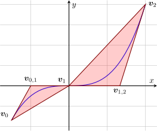

# PolyhedralRelaxations.jl Documentation

```@meta
CurrentModule = PolyhedralRelaxations
```

## Overview

PolyhedralRelaxations.jl is a Julia/JuMP package for constructing Polyhedral Relaxations for graphs of bounded, differentiable, univariate functions. In particular, it can be used to construct a sequence of both MILP and LP relaxation that converge to the graph of the univariate function and its convex hull, respectively. It takes in the function with its domain and the JuMP variables and the JuMP model and populates the model with the relaxation. It returns variable and constraint references for the formulated relaxation. 

## Installation Guide

To use PolyhedralRelaxations, first [download and install](https://julialang.org/downloads/) Julia or open up a remote notebook at [JuliaBox](https://www.juliabox.com/) or similar services.

This version of PolyhedralRelaxations is compatible with Julia 1.0 and later.

From Julia REPL, PolyhedralRelaxations is installed by using the built-in package manager:
```julia
import Pkg
Pkg.add("PolyhedralRelaxations")
```

## Unit Tests
To run the tests in the package, run the following command within the Julia REPL after installing the package.

```julia
import Pkg
Pkg.test("PolyhedralRelaxations")
```

## Quick Introduction to the Theory

### Geometry of relaxations
This quick start guide will introduce the main concepts of PolyhedralRelaxations. The package constructs MILP and LP relaxations for ``y = f(x)``, given the function and discretization points on the domain of ``f(x)``. For instance, given ``y=x^3`` and a partition of the domain ``[-1.5, 0, 2]``, it constructs an MILP relaxation of ``y = x^3`` as the disjunction of the triangles shown in the figure below:



Notice from the above example that, for the above disjunction of triangles to be a valid relaxation for ``y = f(x)``, the partition points must necessarily include the inflection points of the univariate function. Also, in the above example, the domain of the function ``y = x^3`` is given by ``[-1.5, 2]``. The following table provides a list of inflection points for various well-used univariate functions. 

| Function | Inflection points |
| --- | --- |
| ``x^n`` (``n`` is odd)  | ``\{0\}`` |
| ``x^n`` (``n`` is even) | ``\phi`` |
| ``\sin x`` | ``n\pi`` ``(n \in \mathbb Z)`` | 
| ``\cos x`` | ``n\frac{\pi}{2}`` ``(n`` is odd ``)``| 
| ``x\|x\|`` | ``\{0\}``| 

If the domain of the provided function contains an inflection point, then the requirement is that the inflection points should be provided as a discretization point; failing which the MILP relaxation need not be valid for the given function. 

### Type of formulation used
The MILP formulation, obtained as the disjunction of the triangles, is formulated using the incremental method (using the so-called ``\delta`` variables) and the convex hull of the triangles (the LP) is formulated using the standard ``\lambda``-method (V-representation). For details on the formulation and theoretical properties, interested readers are referred to the following paper:

* K. Sundar, S. Sanjeevi, and H, Nagarajan (2020). Sequence of Polyhedral Relaxations for Nonlinear Univariate Functions. ([arxiv link](https://arxiv.org/abs/2005.13445))
